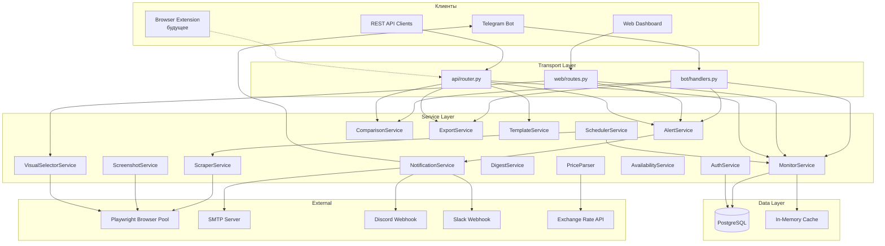
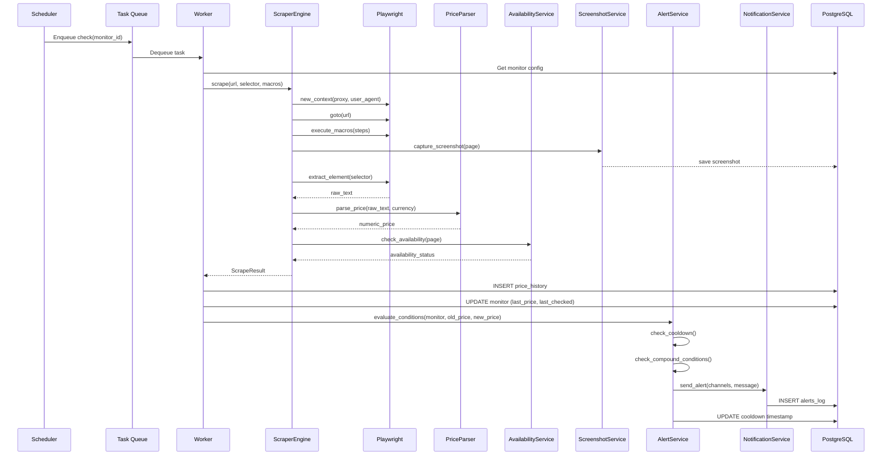
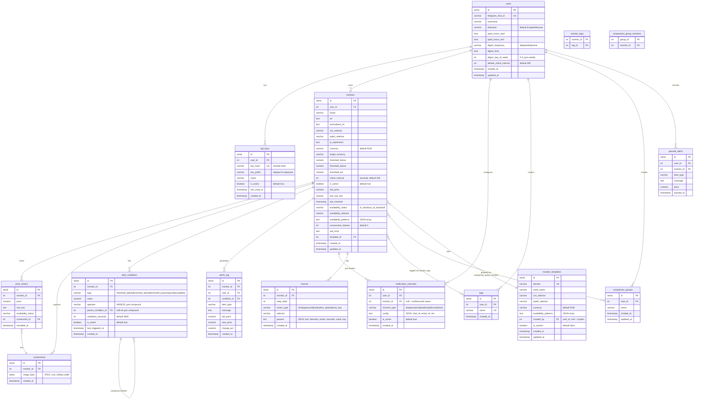

# Дизайн-документ: Price Monitor Pro

## Обзор

Price Monitor Pro — система мониторинга цен, эволюционирующая из текущего прототипа (плоская структура файлов, одна таблица `watches`, один пользователь) в полноценную многопользовательскую платформу с REST API, визуальным селектором, макросами, группами сравнения, мультиканальными уведомлениями и подготовкой к браузерному расширению.

### Ключевые архитектурные решения

1. **Модульная структура** — переход от плоских файлов к пакетной организации `app/` с разделением на слои: models, services, api, bot, web
2. **Async-first** — полный переход на asyncpg + async SQLAlchemy вместо синхронного psycopg2, единый event loop
3. **Единый API-слой** — вся бизнес-логика в сервисном слое; Telegram-бот, веб-дашборд и REST API — тонкие адаптеры
4. **Очередь задач** — asyncio.Queue + worker pool для скрапинга вместо последовательного выполнения
5. **Версионированный API** — `/api/v1/` с JWT/API-key аутентификацией, rate limiting, CORS

### Стек технологий

| Компонент | Текущий | Целевой |
|-----------|---------|---------|
| ORM/DB | psycopg2 raw SQL | asyncpg + SQLAlchemy async (models) |
| Web framework | FastAPI | FastAPI (сохраняется) |
| Telegram | python-telegram-bot | python-telegram-bot (сохраняется) |
| Scheduler | APScheduler global | APScheduler + per-monitor intervals |
| Scraping | Playwright single browser | Playwright pool + retry + proxy |
| Auth | нет | API keys + session tokens |
| Cache | нет | in-memory TTL cache (cachetools) |
| Templates | Jinja2 | Jinja2 (сохраняется) |
| Charts | Chart.js (inline) | Chart.js (сохраняется) |

## Архитектура

### Структура проекта

```
price-monitor-pro/
├── app/
│   ├── __init__.py
│   ├── main.py                  # Entry point: FastAPI + Bot + Scheduler
│   ├── config.py                # Pydantic Settings, env vars
│   ├── database.py              # asyncpg pool, session factory
│   │
│   ├── models/                  # SQLAlchemy models
│   │   ├── __init__.py
│   │   ├── user.py              # User, APIKey
│   │   ├── monitor.py           # Monitor, MonitorTag, MonitorTemplate
│   │   ├── price.py             # PriceHistory, Screenshot
│   │   ├── alert.py             # AlertCondition, AlertLog, NotificationChannel
│   │   ├── comparison.py        # ComparisonGroup, ComparisonGroupMonitor
│   │   └── macro.py             # Macro, MacroStep
│   │
│   ├── services/                # Бизнес-логика
│   │   ├── __init__.py
│   │   ├── monitor_service.py   # CRUD мониторов, валидация, дубликаты
│   │   ├── scraper_service.py   # Playwright pool, retry, proxy, macros
│   │   ├── price_parser.py      # Парсинг цен, мультивалютность, форматирование
│   │   ├── alert_service.py     # Условия, compound conditions, cooldown
│   │   ├── notification_service.py  # Telegram, Email, Webhook, Discord, Slack
│   │   ├── scheduler_service.py # Per-monitor scheduling, queue management
│   │   ├── comparison_service.py # Группы сравнения
│   │   ├── export_service.py    # JSON/CSV экспорт/импорт
│   │   ├── template_service.py  # Шаблоны мониторов для магазинов
│   │   ├── digest_service.py    # Дайджесты, тихие часы
│   │   ├── screenshot_service.py # Скриншоты, хранение, ротация
│   │   ├── availability_service.py # Мониторинг доступности товара
│   │   ├── visual_selector_service.py # Серверный прокси для iframe
│   │   ├── auth_service.py      # Аутентификация, API keys, sessions
│   │   └── cache_service.py     # TTL-кэш
│   │
│   ├── api/                     # REST API v1
│   │   ├── __init__.py
│   │   ├── router.py            # Главный роутер /api/v1
│   │   ├── deps.py              # Зависимости: auth, pagination, rate limit
│   │   ├── monitors.py          # CRUD мониторов
│   │   ├── history.py           # История цен, графики
│   │   ├── alerts.py            # Алерты, условия
│   │   ├── groups.py            # Группы сравнения
│   │   ├── tags.py              # Теги
│   │   ├── export.py            # Импорт/экспорт
│   │   ├── bulk.py              # Массовые операции
│   │   ├── templates.py         # Шаблоны мониторов
│   │   ├── settings.py          # Настройки пользователя
│   │   └── health.py            # Health check
│   │
│   ├── bot/                     # Telegram bot
│   │   ├── __init__.py
│   │   ├── handlers.py          # Команды: /add, /list, /check, /edit, etc.
│   │   ├── conversations.py     # ConversationHandler flows
│   │   ├── callbacks.py         # Inline keyboard callbacks
│   │   ├── formatters.py        # Форматирование сообщений
│   │   └── keyboards.py         # Inline keyboard builders
│   │
│   ├── web/                     # Web dashboard
│   │   ├── __init__.py
│   │   ├── routes.py            # HTML-страницы
│   │   ├── visual_selector.py   # Визуальный селектор (прокси)
│   │   └── auth.py              # Web-аутентификация
│   │
│   └── migrations/              # SQL-миграции (версионные)
│       ├── 001_initial.sql
│       └── 002_full_schema.sql
│
├── templates/                   # Jinja2 шаблоны
│   ├── base.html
│   ├── dashboard.html
│   ├── detail.html
│   ├── alerts.html
│   ├── visual_selector.html
│   ├── settings.html
│   ├── login.html
│   └── macro_builder.html
│
├── static/
│   ├── style.css
│   └── js/
│       ├── visual-selector.js
│       └── macro-builder.js
│
├── Dockerfile
├── docker-compose.yml
├── railway.toml
└── requirements.txt
```

### Диаграмма компонентов



### Поток данных при проверке цены




## Компоненты и интерфейсы

### 1. MonitorService — CRUD мониторов

```python
class MonitorService:
    async def create_monitor(self, user_id: int, data: MonitorCreate) -> Monitor:
        """Создание монитора с валидацией URL, проверкой дубликатов, применением шаблона."""
    
    async def get_monitor(self, user_id: int, monitor_id: int) -> Monitor:
        """Получение монитора с проверкой принадлежности пользователю."""
    
    async def list_monitors(self, user_id: int, filters: MonitorFilters, pagination: Pagination) -> PaginatedResult[Monitor]:
        """Список мониторов с фильтрацией по тегам, поиску, статусу. Пагинация."""
    
    async def update_monitor(self, user_id: int, monitor_id: int, data: MonitorUpdate) -> Monitor:
        """Обновление полей монитора. Валидация CSS-селектора, интервала."""
    
    async def delete_monitor(self, user_id: int, monitor_id: int) -> None:
        """Каскадное удаление: монитор + price_history + alerts_log + screenshots."""
    
    async def toggle_monitor(self, user_id: int, monitor_id: int) -> Monitor:
        """Переключение is_active. При деактивации — удаление из очереди планировщика."""
    
    async def check_duplicate(self, user_id: int, url: str) -> Monitor | None:
        """Проверка дубликата по нормализованному URL."""
    
    async def bulk_operation(self, user_id: int, monitor_ids: list[int], operation: BulkOp) -> BulkResult:
        """Массовые операции: pause, resume, delete, check_now, add_tag."""

    @staticmethod
    def normalize_url(url: str) -> str:
        """Нормализация URL: lowercase домена, сортировка query params, удаление trailing slash."""
    
    @staticmethod
    def validate_css_selector(selector: str) -> bool:
        """Валидация синтаксиса CSS-селектора через cssselect."""
    
    @staticmethod
    def validate_check_interval(seconds: int) -> bool:
        """Проверка: 60 <= seconds <= 2592000 (30 дней)."""
```

### 2. ScraperService — движок скрапинга

```python
class ScraperService:
    def __init__(self, max_browsers: int = 3, proxy_url: str | None = None):
        self._browser_pool: asyncio.Queue[Browser]  # Пул браузеров
        self._user_agents: list[str]  # 10+ User-Agent строк
    
    async def scrape(self, url: str, config: ScrapeConfig) -> ScrapeResult:
        """
        Полный цикл скрапинга:
        1. Получить браузер из пула
        2. Создать контекст (proxy, random UA)
        3. Загрузить страницу (timeout 30s)
        4. Закрыть cookie-баннеры
        5. Выполнить макросы
        6. Сделать скриншот
        7. Извлечь цену (CSS/XPath/JS/auto)
        8. Определить доступность
        9. Вернуть браузер в пул
        """
    
    async def _execute_macros(self, page: Page, steps: list[MacroStep]) -> None:
        """Выполнение шагов макроса: click, type, scroll, wait, select_option, press_key."""
    
    async def _close_popups(self, page: Page) -> None:
        """Попытка закрыть cookie-баннеры и всплывающие окна."""
    
    async def _extract_price(self, page: Page, config: ScrapeConfig) -> tuple[str, float | None]:
        """Извлечение цены: CSS → XPath → JS → auto-detect (15+ селекторов)."""
    
    async def _retry_with_backoff(self, func, max_retries: int = 3) -> Any:
        """Повторные попытки с экспоненциальной задержкой: 5s, 15s, 45s."""

@dataclass
class ScrapeConfig:
    css_selector: str | None
    xpath_selector: str | None
    js_expression: str | None
    macro_steps: list[MacroStep]
    proxy_url: str | None
    currency: str

@dataclass
class ScrapeResult:
    price: float | None
    raw_text: str
    title: str
    screenshot: bytes | None
    availability_status: str | None  # "in_stock" | "out_of_stock" | None
    error: str | None
```

### 3. PriceParser — парсинг и форматирование цен

```python
class PriceParser:
    SUPPORTED_CURRENCIES = {"RUB": "₽", "USD": "$", "EUR": "€", "GBP": "£", "KZT": "₸", "CNY": "¥", "TRY": "₺"}
    
    @staticmethod
    def parse(text: str, currency: str = "RUB") -> float | None:
        """
        Парсинг цены из текста:
        - Удаление символов валют и текстовых обозначений
        - Нормализация пробелов (nbsp, thin space)
        - Определение разделителя тысяч vs десятичного
        - Извлечение числового значения
        """
    
    @staticmethod
    def format_price(value: float, currency: str = "RUB") -> str:
        """
        Форматирование числа в текст с символом валюты:
        - RUB: "1 299,90 ₽"
        - USD: "$12.99"
        - EUR: "12,99 €"
        """
    
    @staticmethod
    async def convert_currency(amount: float, from_currency: str, to_currency: str) -> float:
        """Конвертация по актуальному курсу (кэш 6 часов)."""
```

### 4. AlertService — система условий и алертов

```python
class AlertService:
    async def evaluate_conditions(self, monitor: Monitor, old_price: float | None, new_price: float) -> list[Alert]:
        """
        Оценка всех условий монитора:
        1. threshold_below / threshold_above
        2. threshold_pct (процентное изменение)
        3. Составные условия (AND/OR)
        4. Исторический минимум
        5. Проверка cooldown
        """
    
    async def check_compound_condition(self, condition: AlertCondition, context: AlertContext) -> bool:
        """Рекурсивная оценка составного условия с AND/OR операторами."""
    
    async def is_cooldown_active(self, monitor_id: int, condition_id: int) -> bool:
        """Проверка: прошёл ли cooldown с последнего алерта по данному условию."""
    
    async def log_alert(self, monitor_id: int, alert_type: str, message: str, price: float) -> None:
        """Запись алерта в alerts_log."""

@dataclass
class AlertCondition:
    type: str  # "threshold_below" | "threshold_above" | "threshold_pct" | "compound"
    value: float | None
    operator: str | None  # "AND" | "OR" (для compound)
    sub_conditions: list["AlertCondition"]
    cooldown_seconds: int  # default 3600
```

### 5. NotificationService — каналы уведомлений

```python
class NotificationService:
    async def send(self, channels: list[NotificationChannel], alert: Alert) -> list[SendResult]:
        """Отправка алерта через все активные каналы с retry (3 попытки, 10s задержка)."""
    
    async def send_telegram(self, chat_id: str, message: str, screenshot: bytes | None = None) -> bool:
        """HTML-форматированное сообщение + опциональный скриншот."""
    
    async def send_email(self, to: str, subject: str, body: str) -> bool:
        """SMTP отправка."""
    
    async def send_webhook(self, url: str, payload: dict) -> bool:
        """HTTP POST с JSON: monitor_id, name, url, old_price, new_price, change_pct, timestamp."""
    
    async def send_discord(self, webhook_url: str, message: str) -> bool:
        """Discord webhook embed."""
    
    async def send_slack(self, webhook_url: str, message: str) -> bool:
        """Slack webhook block."""
```

### 6. SchedulerService — планировщик

```python
class SchedulerService:
    def __init__(self, max_concurrent: int = 5):
        self._queue: asyncio.PriorityQueue  # (next_run_time, monitor_id)
        self._workers: list[asyncio.Task]
        self._semaphore: asyncio.Semaphore(max_concurrent)
    
    async def start(self) -> None:
        """Загрузить все активные мониторы, распределить проверки равномерно, запустить workers."""
    
    async def schedule_monitor(self, monitor_id: int, interval: int) -> None:
        """Добавить/обновить расписание монитора."""
    
    async def unschedule_monitor(self, monitor_id: int) -> None:
        """Удалить монитор из расписания (при деактивации/удалении)."""
    
    async def enqueue_immediate(self, monitor_ids: list[int]) -> None:
        """Поставить немедленную проверку в очередь."""
    
    async def _worker(self) -> None:
        """Worker loop: dequeue → scrape → save → alert. Semaphore ограничивает параллелизм."""
    
    async def _distribute_evenly(self, monitors: list[Monitor]) -> None:
        """Распределить начальные проверки равномерно по интервалу, избегая burst."""
```

### 7. VisualSelectorService — визуальный селектор

```python
class VisualSelectorService:
    async def proxy_page(self, url: str) -> str:
        """
        Серверный прокси:
        1. Загрузить страницу через Playwright
        2. Получить rendered HTML
        3. Переписать относительные URL на абсолютные
        4. Инжектировать JS для перехвата кликов и генерации селекторов
        5. Вернуть модифицированный HTML для iframe
        """
    
    @staticmethod
    def generate_css_selector(element_path: list[dict]) -> str:
        """Генерация уникального CSS-селектора по пути элемента в DOM."""
    
    @staticmethod
    def generate_xpath(element_path: list[dict]) -> str:
        """Генерация XPath-выражения по пути элемента."""
```

### 8. AuthService — аутентификация

```python
class AuthService:
    async def get_or_create_user(self, telegram_chat_id: str) -> User:
        """Создание пользователя при первом взаимодействии с ботом."""
    
    async def generate_api_key(self, user_id: int) -> str:
        """Генерация 64-символьного API-ключа (secrets.token_hex(32))."""
    
    async def authenticate_api_key(self, key: str) -> User | None:
        """Поиск пользователя по API-ключу."""
    
    async def create_session_token(self, user_id: int) -> str:
        """JWT-токен для веб-сессии (exp: 24h)."""
    
    async def verify_session_token(self, token: str) -> User | None:
        """Верификация JWT."""
```

### 9. ExportService — импорт/экспорт

```python
class ExportService:
    async def export_json(self, user_id: int) -> dict:
        """Экспорт всех мониторов с настройками, тегами, историей цен."""
    
    async def export_csv(self, user_id: int) -> str:
        """CSV: monitor_name, url, current_price, min_price, max_price, avg_price, currency, tags, created_at."""
    
    async def import_json(self, user_id: int, data: dict) -> ImportResult:
        """Валидация + создание мониторов. Возврат отчёта: imported, skipped, errors."""
```

### 10. DigestService — дайджесты и тихие часы

```python
class DigestService:
    async def check_quiet_hours(self, user_id: int) -> bool:
        """Проверка: сейчас тихие часы для пользователя?"""
    
    async def queue_alert(self, user_id: int, alert: Alert) -> None:
        """Поставить алерт в очередь (во время тихих часов)."""
    
    async def send_queued_alerts(self, user_id: int) -> None:
        """Отправить все накопленные алерты одним дайджест-сообщением."""
    
    async def generate_daily_digest(self, user_id: int) -> str:
        """Ежедневный дайджест: все изменения цен за 24 часа."""
    
    async def generate_weekly_digest(self, user_id: int) -> str:
        """Еженедельный дайджест: тренды, лучшие предложения."""
```


## Модели данных

### Схема базы данных



### SQL-миграция (002_full_schema.sql)

```sql
-- Users
CREATE TABLE IF NOT EXISTS users (
    id SERIAL PRIMARY KEY,
    telegram_chat_id VARCHAR(50) UNIQUE,
    username VARCHAR(255),
    timezone VARCHAR(50) DEFAULT 'Europe/Moscow',
    quiet_hours_start TIME,
    quiet_hours_end TIME,
    digest_frequency VARCHAR(20) DEFAULT 'none',
    digest_time TIME DEFAULT '09:00',
    digest_day_of_week INTEGER DEFAULT 1,
    default_check_interval INTEGER DEFAULT 300,
    created_at TIMESTAMP DEFAULT NOW(),
    updated_at TIMESTAMP DEFAULT NOW()
);

-- API Keys
CREATE TABLE IF NOT EXISTS api_keys (
    id SERIAL PRIMARY KEY,
    user_id INTEGER REFERENCES users(id) ON DELETE CASCADE,
    key_hash VARCHAR(64) UNIQUE NOT NULL,
    key_prefix VARCHAR(8) NOT NULL,
    name VARCHAR(255),
    is_active BOOLEAN DEFAULT true,
    last_used_at TIMESTAMP,
    created_at TIMESTAMP DEFAULT NOW()
);

-- Monitors (расширение существующей watches)
ALTER TABLE watches RENAME TO monitors;
ALTER TABLE monitors ADD COLUMN IF NOT EXISTS user_id INTEGER REFERENCES users(id);
ALTER TABLE monitors ADD COLUMN IF NOT EXISTS normalized_url TEXT;
ALTER TABLE monitors ADD COLUMN IF NOT EXISTS xpath_selector VARCHAR(500);
ALTER TABLE monitors ADD COLUMN IF NOT EXISTS js_expression TEXT;
ALTER TABLE monitors ADD COLUMN IF NOT EXISTS target_currency VARCHAR(10);
ALTER TABLE monitors ADD COLUMN IF NOT EXISTS availability_status VARCHAR(20);
ALTER TABLE monitors ADD COLUMN IF NOT EXISTS availability_selector VARCHAR(500);
ALTER TABLE monitors ADD COLUMN IF NOT EXISTS availability_patterns TEXT;
ALTER TABLE monitors ADD COLUMN IF NOT EXISTS consecutive_failures INTEGER DEFAULT 0;
ALTER TABLE monitors ADD COLUMN IF NOT EXISTS last_error TEXT;
ALTER TABLE monitors ADD COLUMN IF NOT EXISTS last_raw_text TEXT;
ALTER TABLE monitors ADD COLUMN IF NOT EXISTS template_id INTEGER;

-- Screenshots
CREATE TABLE IF NOT EXISTS screenshots (
    id SERIAL PRIMARY KEY,
    monitor_id INTEGER REFERENCES monitors(id) ON DELETE CASCADE,
    image_data BYTEA NOT NULL,
    created_at TIMESTAMP DEFAULT NOW()
);

-- Price history: добавить поля
ALTER TABLE price_history ADD COLUMN IF NOT EXISTS availability_status VARCHAR(20);
ALTER TABLE price_history ADD COLUMN IF NOT EXISTS screenshot_id INTEGER REFERENCES screenshots(id) ON DELETE SET NULL;

-- Alert conditions
CREATE TABLE IF NOT EXISTS alert_conditions (
    id SERIAL PRIMARY KEY,
    monitor_id INTEGER REFERENCES monitors(id) ON DELETE CASCADE,
    type VARCHAR(50) NOT NULL,
    value NUMERIC(12,2),
    operator VARCHAR(5),
    parent_condition_id INTEGER REFERENCES alert_conditions(id) ON DELETE CASCADE,
    cooldown_seconds INTEGER DEFAULT 3600,
    is_active BOOLEAN DEFAULT true,
    last_triggered_at TIMESTAMP,
    created_at TIMESTAMP DEFAULT NOW()
);

-- Alerts log: расширение
ALTER TABLE alerts_log ADD COLUMN IF NOT EXISTS user_id INTEGER REFERENCES users(id);
ALTER TABLE alerts_log ADD COLUMN IF NOT EXISTS condition_id INTEGER REFERENCES alert_conditions(id) ON DELETE SET NULL;
ALTER TABLE alerts_log ADD COLUMN IF NOT EXISTS old_price NUMERIC(12,2);
ALTER TABLE alerts_log ADD COLUMN IF NOT EXISTS new_price NUMERIC(12,2);
ALTER TABLE alerts_log ADD COLUMN IF NOT EXISTS change_pct NUMERIC(8,4);

-- Notification channels
CREATE TABLE IF NOT EXISTS notification_channels (
    id SERIAL PRIMARY KEY,
    user_id INTEGER REFERENCES users(id) ON DELETE CASCADE,
    monitor_id INTEGER REFERENCES monitors(id) ON DELETE CASCADE,
    channel_type VARCHAR(20) NOT NULL,
    config TEXT NOT NULL,
    is_active BOOLEAN DEFAULT true,
    created_at TIMESTAMP DEFAULT NOW()
);

-- Tags
CREATE TABLE IF NOT EXISTS tags (
    id SERIAL PRIMARY KEY,
    user_id INTEGER REFERENCES users(id) ON DELETE CASCADE,
    name VARCHAR(100) NOT NULL,
    created_at TIMESTAMP DEFAULT NOW(),
    UNIQUE(user_id, name)
);

CREATE TABLE IF NOT EXISTS monitor_tags (
    monitor_id INTEGER REFERENCES monitors(id) ON DELETE CASCADE,
    tag_id INTEGER REFERENCES tags(id) ON DELETE CASCADE,
    PRIMARY KEY (monitor_id, tag_id)
);

-- Comparison groups
CREATE TABLE IF NOT EXISTS comparison_groups (
    id SERIAL PRIMARY KEY,
    user_id INTEGER REFERENCES users(id) ON DELETE CASCADE,
    name VARCHAR(255) NOT NULL,
    created_at TIMESTAMP DEFAULT NOW(),
    updated_at TIMESTAMP DEFAULT NOW()
);

CREATE TABLE IF NOT EXISTS comparison_group_monitors (
    group_id INTEGER REFERENCES comparison_groups(id) ON DELETE CASCADE,
    monitor_id INTEGER REFERENCES monitors(id) ON DELETE CASCADE,
    PRIMARY KEY (group_id, monitor_id)
);

-- Macros
CREATE TABLE IF NOT EXISTS macros (
    id SERIAL PRIMARY KEY,
    monitor_id INTEGER REFERENCES monitors(id) ON DELETE CASCADE,
    step_order INTEGER NOT NULL,
    action_type VARCHAR(50) NOT NULL,
    selector VARCHAR(500),
    params TEXT,
    created_at TIMESTAMP DEFAULT NOW()
);

-- Monitor templates
CREATE TABLE IF NOT EXISTS monitor_templates (
    id SERIAL PRIMARY KEY,
    domain VARCHAR(255) UNIQUE NOT NULL,
    store_name VARCHAR(255) NOT NULL,
    css_selector VARCHAR(500),
    xpath_selector VARCHAR(500),
    currency VARCHAR(10) DEFAULT 'RUB',
    availability_patterns TEXT,
    created_by INTEGER REFERENCES users(id),
    is_system BOOLEAN DEFAULT false,
    created_at TIMESTAMP DEFAULT NOW(),
    updated_at TIMESTAMP DEFAULT NOW()
);

ALTER TABLE monitors ADD CONSTRAINT fk_monitors_template
    FOREIGN KEY (template_id) REFERENCES monitor_templates(id) ON DELETE SET NULL;

-- Queued alerts (для тихих часов)
CREATE TABLE IF NOT EXISTS queued_alerts (
    id SERIAL PRIMARY KEY,
    user_id INTEGER REFERENCES users(id) ON DELETE CASCADE,
    monitor_id INTEGER REFERENCES monitors(id) ON DELETE CASCADE,
    alert_type VARCHAR(50) NOT NULL,
    message TEXT NOT NULL,
    price NUMERIC(12,2),
    queued_at TIMESTAMP DEFAULT NOW()
);

-- Индексы
CREATE INDEX IF NOT EXISTS idx_monitors_user ON monitors(user_id);
CREATE INDEX IF NOT EXISTS idx_monitors_normalized_url ON monitors(normalized_url);
CREATE INDEX IF NOT EXISTS idx_monitors_active ON monitors(is_active);
CREATE INDEX IF NOT EXISTS idx_ph_monitor ON price_history(monitor_id);
CREATE INDEX IF NOT EXISTS idx_ph_recorded ON price_history(recorded_at);
CREATE INDEX IF NOT EXISTS idx_ph_monitor_time ON price_history(monitor_id, recorded_at DESC);
CREATE INDEX IF NOT EXISTS idx_alerts_user ON alerts_log(user_id);
CREATE INDEX IF NOT EXISTS idx_alerts_monitor ON alerts_log(monitor_id);
CREATE INDEX IF NOT EXISTS idx_alerts_created ON alerts_log(created_at);
CREATE INDEX IF NOT EXISTS idx_screenshots_monitor ON screenshots(monitor_id);
CREATE INDEX IF NOT EXISTS idx_api_keys_hash ON api_keys(key_hash);
CREATE INDEX IF NOT EXISTS idx_nc_user ON notification_channels(user_id);
CREATE INDEX IF NOT EXISTS idx_nc_monitor ON notification_channels(monitor_id);
CREATE INDEX IF NOT EXISTS idx_macros_monitor ON macros(monitor_id, step_order);
CREATE INDEX IF NOT EXISTS idx_queued_user ON queued_alerts(user_id);
CREATE INDEX IF NOT EXISTS idx_templates_domain ON monitor_templates(domain);
```

### REST API v1 — эндпоинты

| Метод | Путь | Описание | Auth |
|-------|------|----------|------|
| POST | /api/v1/auth/token | Получить JWT по API-ключу | API Key |
| GET | /api/v1/monitors | Список мониторов (пагинация, фильтры) | JWT/API Key |
| POST | /api/v1/monitors | Создать монитор | JWT/API Key |
| GET | /api/v1/monitors/{id} | Детали монитора | JWT/API Key |
| PUT | /api/v1/monitors/{id} | Обновить монитор | JWT/API Key |
| DELETE | /api/v1/monitors/{id} | Удалить монитор | JWT/API Key |
| POST | /api/v1/monitors/{id}/check | Немедленная проверка | JWT/API Key |
| GET | /api/v1/monitors/{id}/history | История цен (days, limit) | JWT/API Key |
| GET | /api/v1/monitors/{id}/chart | Данные для графика | JWT/API Key |
| GET | /api/v1/monitors/{id}/screenshots | Скриншоты монитора | JWT/API Key |
| POST | /api/v1/monitors/bulk | Массовые операции | JWT/API Key |
| GET | /api/v1/alerts | Лог алертов (пагинация, фильтры) | JWT/API Key |
| GET | /api/v1/alerts/conditions/{monitor_id} | Условия алертов монитора | JWT/API Key |
| POST | /api/v1/alerts/conditions | Создать условие алерта | JWT/API Key |
| GET | /api/v1/groups | Группы сравнения | JWT/API Key |
| POST | /api/v1/groups | Создать группу | JWT/API Key |
| GET | /api/v1/groups/{id} | Детали группы с ценами | JWT/API Key |
| PUT | /api/v1/groups/{id} | Обновить группу | JWT/API Key |
| DELETE | /api/v1/groups/{id} | Удалить группу | JWT/API Key |
| GET | /api/v1/tags | Список тегов | JWT/API Key |
| POST | /api/v1/tags | Создать тег | JWT/API Key |
| DELETE | /api/v1/tags/{id} | Удалить тег | JWT/API Key |
| GET | /api/v1/export/json | Экспорт в JSON | JWT/API Key |
| GET | /api/v1/export/csv | Экспорт в CSV | JWT/API Key |
| POST | /api/v1/import/json | Импорт из JSON | JWT/API Key |
| GET | /api/v1/templates | Список шаблонов | JWT/API Key |
| POST | /api/v1/templates | Создать шаблон | JWT/API Key |
| GET | /api/v1/stats | Общая статистика | JWT/API Key |
| GET | /api/v1/settings | Настройки пользователя | JWT/API Key |
| PUT | /api/v1/settings | Обновить настройки | JWT/API Key |
| GET | /health | Health check | Нет |

### Формат ответа API

```json
{
  "data": { ... },
  "error": null,
  "meta": {
    "total": 150,
    "page": 1,
    "per_page": 20,
    "total_pages": 8
  }
}
```

### Формат ошибки API

```json
{
  "data": null,
  "error": "Невалидный URL: ожидается http:// или https://",
  "meta": null
}
```

### Rate Limiting

- 100 запросов в минуту на API-ключ
- Реализация: sliding window counter в памяти (dict[api_key] → deque[timestamp])
- HTTP 429 при превышении с заголовком `Retry-After`

### Telegram Bot — команды

| Команда | Описание |
|---------|----------|
| /start | Приветствие, создание пользователя |
| /add | Пошаговый диалог добавления монитора |
| /list | Список мониторов с inline-кнопками (пагинация по 10) |
| /check | Немедленная проверка всех активных |
| /detail_{id} | Детали монитора со статистикой |
| /edit_{id} | Редактирование монитора |
| /stats | Общая статистика |
| /report | Сводный отчёт за 24 часа |
| /compare_{group_id} | Сравнительная таблица группы |
| /settings | Настройки (интервал, каналы, часовой пояс) |
| /export | Экспорт мониторов в JSON-файл |
| /apikey | Генерация API-ключа |
| /digest | Немедленный дайджест |
| /help | Справка |

Отправка URL без команды → предложение создать монитор с автоопределением.

